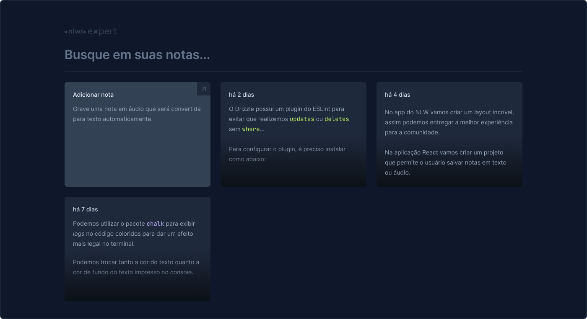

# Notes

Essa aplicação foi desenvolvida durante o NLW Experts da Rocketseat utilizando React, TypeScript, Tailwind e a SpeechRecognition API.


## Executando

Após clonar o repositório, acesse a pasta do projeto e execute os comandos abaixo:

```bash
  npm install
  npm run dev
```
    